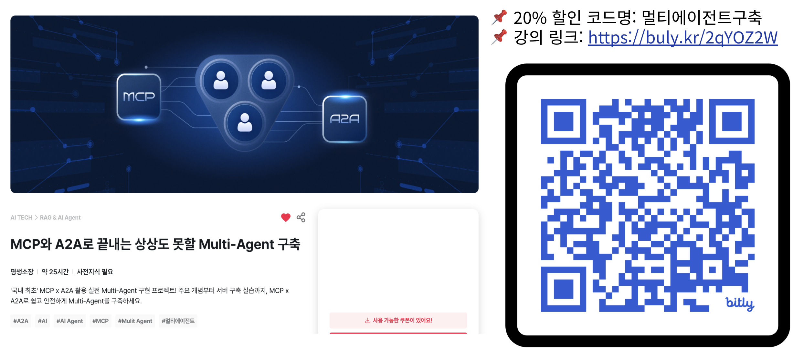

# FastCampus! LangGraph, MCP, A2A 프로토콜 기반 멀티 에이전트 업무 Assistant Workflow

LangGraph와 MCP를 기반으로 한 에이전트들이 A2A 프로토콜로 상호 통신하여 업무 워크플로를 자동화하는 멀티 에이전트 예제 프로젝트입니다.

---



---

## 개요

- **목표**: 브라우저 자동화, 메모리, 실행기 등 MCP 도구를 결합하고, LangGraph 기반 Supervisor-Worker 패턴으로 복합 업무를 자동화합니다.
- **통신**: 에이전트 간 통신은 표준화된 A2A 프로토콜(JSON-RPC 2.0)을 사용합니다.
- **컨테이너화**: 모든 에이전트 및 보조 서비스는 Docker로 구동합니다.

## 핵심 구성요소

- **Supervisor Agent**: 전체 워크플로를 오케스트레이션합니다.
- **Planner Agent**: 사용자 요구를 단계별 JSON 계획으로 분해합니다.
- **Browser Agent**: Playwright MCP를 통해 브라우저 자동화를 수행합니다.
- **Executor Agent**: Notion MCP, LangChain Sandbox MCP 등 외부 도구 실행을 담당합니다.
- **Knowledge Agent**: OpenMemory MCP 기반 RAG 검색을 제공합니다.

## 프로젝트 구조

```text
.
├── a2a-inspector/                # A2A 통신 모니터링 도구(웹 UI/백엔드)
├── docker/                       # Docker 관련 문서/구성
├── docker-compose-full.yml       # 전체 서비스 오케스트레이션
├── Dockerfile                    # 공용 베이스 이미지
├── docs/                         # 사양/레퍼런스 문서
├── examples/                     # 예제 스크립트(에이전트별 a2a/langgraph)
├── mem0/                         # OpenMemory MCP 및 UI
├── src/                          # 애플리케이션 소스 코드
│   ├── a2a_integration/          # A2A 클라이언트/서버 유틸리티, 인증, 모델
│   ├── agents/                   # 에이전트 구현체(supervisor, planner, browser 등)
│   ├── base/                     # BaseGraphAgent/State, A2A 인터페이스, 공용 유틸
│   └── mcp_config_module/        # MCP 서버 설정 및 헬스체커
├── pyproject.toml                # 의존성 및 도구 설정(uv, ruff 등)
├── run-docker.ps1                # Windows용 실행 스크립트(1-run-docker.sh 과 같음)
├── 1-run-docker.sh               # 유닉스(MaxOS, Linux 등) 용 실행 스크립트
├── run-langchain-sandbox-mcp.sh  # LangChain Sandbox MCP 로컬 실행 스크립트
└── README.md
```

## 실행 방법

### 1) Docker로 전체 서비스 실행

사전 준비: `.env` 파일에 필수 환경 변수를 설정합니다. 없으면 최초 실행 시 템플릿에서 생성됩니다.

```bash
# 권한 부여
chmod +x 1-run-docker.sh

# 전체 서비스 시작 (Playwright MCP 포함 확인 절차 수행)
./1-run-docker.sh start

# 상태/로그/중지/정리
./1-run-docker.sh status
./1-run-docker.sh logs
./1-run-docker.sh stop
./1-run-docker.sh clean

# MCP 서비스만 기동(Playwright MCP + Notion/OpenMemory/Qdrant)
./1-run-docker.sh mcp-only
```

직접 compose 명령으로 올릴 수도 있습니다.

```bash
docker compose -f docker-compose-full.yml up -d --build
docker compose -f docker-compose-full.yml ps
docker compose -f docker-compose-full.yml logs -f supervisor-agent
```

주요 포트/엔드포인트:

- Supervisor: `http://localhost:8000`
- Planner: `http://localhost:8001`
- Executor: `http://localhost:8004`
- Browser: `http://localhost:8005`
- Knowledge: `http://localhost:8006`
- Notion MCP: `http://localhost:8930`
- Playwright MCP: `http://localhost:8931`
- OpenMemory MCP: `http://localhost:8031`
- LangChain Sandbox MCP: `http://localhost:8035`

컨테이너 내부에서의 MCP 접근 URL 예시:

- Notion MCP: `http://notion-mcp:3000/mcp`
- OpenMemory MCP: `http://openmemory-mcp:8031/mcp`
- Playwright MCP: `http://host.docker.internal:8931/mcp`

### 2) 로컬 개발 환경(uv)에서 에이전트 실행

```bash
# 의존성 설치
uv sync

# PYTHONPATH 설정
export PYTHONPATH="${PWD}/src"

# Supervisor/Planner 실행 예시
uv run python -m src.agents.supervisor
uv run python -m src.agents.planner
```

### 3) LangChain Sandbox MCP 로컬 실행

사전 조건: Deno 설치 필요. 스크립트는 포트/네트워크/디버그 옵션을 제공합니다.

```bash
chmod +x run-langchain-sandbox-mcp.sh
./run-langchain-sandbox-mcp.sh
```

## 환경 변수

필수 항목은 `.env.example`을 참고하십시오.

- `OPENAI_API_KEY`: LLM 호출에 필요합니다.
- `USER`: 일부 서비스 컨테이너 환경에 활용됩니다.
- `NOTION_TOKEN`: Notion MCP 인증 토큰
- `NOTION_PARENT_PAGE_ID`: Executor가 Notion에 문서를 생성할 때 상위 페이지

에이전트 런타임 설정(기본값은 compose에서 지정):

- `IS_DOCKER`: Docker 실행 여부 플래그
- `AGENT_HOST`, `AGENT_PORT`: 에이전트 서버 바인딩
- `NOTION_MCP_URL`, `OPENMEMORY_MCP_URL`, `PLAYWRIGHT_MCP_URL`: MCP 엔드포인트

## 기술 스택

- Python 3.12
- LangGraph 0.6.6
- A2A SDK 0.3.3 이상
- LangChain, langchain-mcp-adapters, LangChain Sandbox
- structlog, uvloop 등 운영 보조 라이브러리

## 개발 생산성

```bash
# 코드 품질 검사 및 포맷팅 (Ruff)
uv run ruff check src/
uv run ruff check src/ --fix
uv run ruff format src/

# 테스트 (pytest)
uv run pytest
uv run pytest --cov=src tests/
```

`pyproject.toml`에는 의존성과 개발 도구 구성이 정의되어 있습니다. Python 버전 제약은 `>=3.12,<3.13`입니다.

## 아키텍처 개요

- 모든 에이전트는 `BaseGraphAgent`를 상속하며, `init_nodes`, `init_edges`를 구현합니다.
- A2A 클라이언트/서버 유틸은 `src/a2a_integration`에 있으며, 표준 JSON-RPC 메시지 교환을 제공합니다.
- MCP 통합은 Playwright, Notion, OpenMemory, LangChain Sandbox를 기본 대상으로 합니다.

간단한 A2A 호출 예시:

```python
# A2A 클라이언트 초기화 예시
from src.a2a_integration.a2a_lg_client_utils import A2AClientManager

manager = A2AClientManager(base_url="http://planner-agent:8000", streaming=False)
client = await manager.initialize()
result = await client.send_data({"messages": [{"role": "user", "content": "query"}]})
```

## Docker 컴포지션 개요

`docker-compose-full.yml`은 Supervisor/Planner/Executor/Browser/Knowledge 에이전트와 MCP 서버들(Notion, OpenMemory, LangChain Sandbox, Qdrant)을 하나의 브리지 네트워크로 묶어 기동합니다. Playwright MCP는 호스트에서 8931 포트로 기동 후 컨테이너에서 `host.docker.internal`을 통해 접근하는 구성을 권장합니다.

주요 서비스 요약:

- Planner 에이전트: 포트 8001 → 내부 8000
- Supervisor 에이전트: 포트 8000 → 내부 8000
- Browser 에이전트: 포트 8005 → 내부 8000
- Executor 에이전트: 포트 8004 → 내부 8000
- Knowledge 에이전트: 포트 8006 → 내부 8000
- Notion MCP: 호스트 8930 → 컨테이너 3000
- OpenMemory MCP: 호스트 8031
- LangChain Sandbox MCP: 호스트 8035

## 참고 문서

- 루트 아키텍처 문서: `AGENT.md`
- 소스 구조 문서: `src/AGENT.md`
- 베이스/공용 모듈: `src/base/AGENT.md`
- A2A 통합: `src/a2a_integration/AGENT.md`
- MCP 설정 모듈: `src/mcp_config_module/AGENT.md`
- 배포/서비스 문서: `docker/AGENT.md`
- A2A 인스펙터: `a2a-inspector/AGENT.md`
- Notion MCP 가이드: `docker/mcp-notion.md`
- Playwright MCP 가이드: `docker/mcp-playwright.md`

## 주의 사항

- 모든 문서는 한글로 작성하며 이모지는 사용하지 않습니다.
- 기존 구현을 재사용하고 확장하는 방식을 우선합니다. 베이스 클래스/유틸을 재작성하지 마십시오.
- 컨테이너에서 브라우저 자동화를 안정적으로 사용하려면 Playwright MCP를 호스트에서 먼저 기동하고 연결을 확인하십시오.
